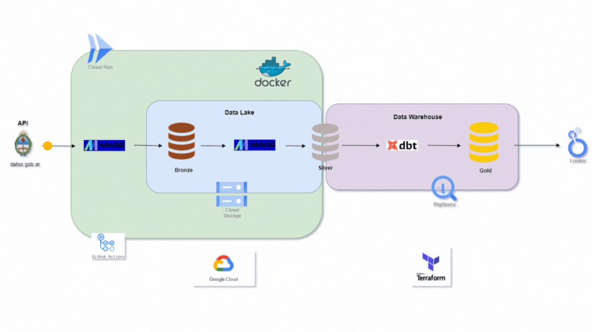

# Analysis of exports of Argentine provinces

###

From the official public data page of the Argentine state, an analysis of the exports of each province is carried out during the last 30 years.
This is done for the final project instance of the [Data Engineering Zoomcamp](https://datatalks.club/blog/data-engineering-zoomcamp.html) course of [Datatalks.Club](https://datatalks.club/ )

---
## Summary

In this project, a data pipeline is created from end-to-end, applying a modern stack of technologies for Data Engineering.
The dataset is extracted from an API of the Argentine state data page, it is dumped into a Data Lake, where various operations are performed and then, once cleaned and optimized, the data is taken to a Data Warehouse and made available to be consulted by Data Visualization tools for their respective analysis.
This pipeline is deployed in the cloud using  tools such infrastructure as code (IaC) and one of the most popular cloud providers today.

---
## Quick Links
- [Objectives](#objectives)
- [Introduction](#introduction)
    - [Architecture](#architecture)
    - [Dataset Interest](#dataset-interest)
    - [Dataset](#dataset)
- [Development](#development)
    - [Tools](#tools)
    - [Pipeline](#pipeline)
- [Conclusions](#conclusions)
- [Replicate Project](#replicate-project)
- [Contact](#contact)

---
## Objectives

- Create an end-to-end batch data pipeline using the tools learned in the course.
- Deploy the pipeline so that it is automated and running in the cloud, replicating a production environment of a professional company.
- Create a dashboard for data analysis of the dataset used.
- Integrate all the knowledge and tools that were used throughout the course.

---
## Introduction

### Architecture

To carry out this project, the following architecture was used:

The data flow begins with the ingestion of data from the API to the data lake, the medallion architecture technique is used where the raw data is stored in what is called _bronze_ layer of the data lake, then with the objective of ordering them it is perform various operations to clean, process, refine and store them in the _silver_ layer of the data lake.
Then they go to the last stage of transformations and are stored in the _gold_ layer, already in the data warehouse, where they are ready to be used by business intelligence tools.

### Dataset Interest:

These days in Argentina (April-2024) there is a profound change in government policies with the last change of government and its totally opposite vision of the functioning of the state that took place in recent years.
We go from a vision where the state had to be omnipresent to a vision where the state is the cause of all evil and therefore has to be removed from as many places as possible. In this scenario there is a lot of tension between the federal government and the provincial ones who do not support the new vision since none of the governors belong to the federal government party.  
This leads to many conflicts over the distribution of funds that the federal government must make with the provinces, and also over the creation and/or elimination of taxes that the federal government wants to do, but cannot because it does not have enough legislators, and for this reason, it must negotiate with the provinces so that the legislators belonging to them vote on the proposed laws, but the different provinces have a different vision and also conflicting interests, since economic activity is very varied in the various regions and the priorities of the provinces. governors do not agree.     
At the same time, Argentina is one of the few countries that has taxes on its exports, the so-called *Retenciones*, which is a permanent focus of conflict since the different governments raise and lower the tariff on the different categories of exports according to to the priorities they have, and which, due to what was mentioned above, conflicts with the priority of the governor of the region that produces that certain exportable product. 

To understand the problem described above, various questions can be asked such as:
What is the amount of exports from each province? To understand how much the rise or not of export taxes affects the different provinces.      
What category are they and what is the proportion of each province's exports? To analyze the type of productive matrix and how the fall or rise in the activity of these regional economies affects each specific province.     
What are the main export destinations of each province? To evaluate the need to redefine international trade agreements with different markets and how that can influence increasing or decreasing the regional economy of each area.  

With the aim of bringing a little clarity to this current problem, and making available a tool that helps the analysis of this situation, this project proposes to carry out an analysis of the exports of each of the provinces, differentiating them by categories. and final destinations.

### Dataset

The data used for this project is taken from the public data platform of the Argentine state [datos.gob.ar](https://datos.gob.ar/). In this particular case of the *Economy and Finance* section, the following datasets will be used:
- [*Exports by province and category. Annual data*](https://datos.gob.ar/nl/dataset/sspm-exportaciones-por-provincia-rubro/archivo/sspm_350.1)     : This dataset consists of 31 rows and 141 columns, it has the values ​​of the amount of product exports of each province, classified by product categories, the dataset looks as follows:

>     

- [Exports by province and by country of destination. Annual values*](https://datos.gob.ar/nl/dataset/sspm-exportaciones-por-provincia-por-pais-destino/archivo/sspm_357.1):
This dataset consists of 31 rows and 337 columns, it has the number of exports from each province classified by destination country, its composition can be seen in the following image:
>    

---

## Development

### Tools

- **Languages**: Python, Sql, Bash
- **Orchestration**: Mage
- **Data Lake**: Google Cloud Storage
- **Data Warehouse**: Google Big Query
- **Modeling**: Dbt
- **Visualization**: Google Looker Studio
- **Deploy**: Terraform
- **Infrastructure**: Google Cloud Platform (Cloud Run, Artifact Registry, Cloud SQL, Cloud Filestore, Compute Engine) 
- **CI/CD**: Github Actions, dbt Cloud
- **Develop**: Docker, Postgres, Google Colab, Git

### Pipeline

#### 1) Data ingestion: From API to the bronze layer

>    

To ingest data from the API to the bronze layer of the data lake, [Mage](https://www.mage.ai/) was used, an open source and modern tool to carry out all types of pipelines. Two _Data Loader_ blocks were used to extract the two datasets from their respective APIs, then a _Data Exporter_ block was used to deposit that raw data in the Google Cloud Storage bucket used as a data lake.

>  

These *Mage* blocks use Python language to perform their tasks. It should be noted that in Mage the same blocks can also be used but with SQL or R language to perform the same tasks that in this case are done with Python.

#### 2) Transformation and Loading: from bronze to the silver layer

The first stage of transformations to the raw data are done in this phase where the data is extracted from the bronze layer of the data lake from Google Cloud Storage, and then various operations are performed.

>  

The dataset, as shown above, has time data in one column and the rest of the rows are numerical values ​​that correspond to the value of the exports, the origin of the value, and the category or destination of the same (depending on the dataset that is being analyzed) is found in the name of each column, therefore several transformations are performed to achieve better structured data.

>  

There are 2 pipelines working in parallel, one for each dataset, the first step is to extract the data from GCS, perform various operations and reload the data into GCS but this time in the silver layer.   

At the entrance of this stage the dataset has this [shape](#dataset), at the exit of this stage that is, in the silver layer it has this structure:

>  

#### 3) Data modeling

The second stage of transformations occurs when they go from the silver layer to the gold layer where the data is ready to be consumed by business intelligence tools. In this layer the data must already have an optimal format to carry out analysis therefore has to be a denormalized, clustered and partitioned table. This makes the consumption of data by the tools that require it much more efficient.

>  

At this stage, to carry out the necessary transformations, the tool [dbt](https://www.getdbt.com/) is used, it has 2 ways of being used: _dbt core_ is the open source version and _dbt cloud_ is the version paid but has a free development layer and is the one used on this occasion.
Data modeling a while ago was done by hand and each developer had different techniques and tools to do it, _dbt_ comes to centralize all of this in a single tool, making the modeling much easier and more intuitive to do, through yml files and SQL language, various transformations are executed, which are executed with the data warehouse engine where the data is hosted, in this case by Big Query.

> 

First of all, the _staging_ occurs, which consists of loading the different tables from the silver layer and hosting them in the data warehouse, to from now on carry out the following transformations using its engine, the next thing that is done is the adaptation of names and data types, rounding, etc. All these intermediate stages are materialized as *views* by *dbt*, since they are intermediate steps and for these purposes it is an optimal way to do it.
Finally, the fact tables are created and materialized as *tables* for greater persistence of the data and so that they are ready to be consulted by the data analysis tool of the subsequent stage.

#### 4) Deploy

For the deployment of the pipeline, [Terraform](https://www.terraform.io/) was used, this tool serves to build infrastructure from the different cloud providers in an easy way and that everything is done with code instead of by different graphical interfaces from each provider, this makes everything more centralized and also by doing it by code allows us to have version control of the infrastructure and ensure that if something fails we can go back to a previous version until the problem is corrected.

[Google Cloud Platform](https://console.cloud.google.com/) was used as the infrastructure provider for the deployment, which is Google's cloud service. Various services were used within the platform, such as:
- _Cloud Run_ to run the Docker container that _Mage_ uses.
- _Cloud Storage_ which was used as a data lake.
- _Big Query_ which was used as a data warehouse.
- _Cloud SQL_ which is used by _Mage_ to run an instance of _Postgres_ that it uses as an auxiliary database.
- _Artifact Registry_ which serves to host the _Docker_ container image that is then deployed to _Cloud Run_.
- _Cloud Filestore_ which is used by _Mage_ for data persistence between the different _Cloud Run_ instances that can be created if necessary.
- _Compute Engine_ for virtual machines where _Cloud Run_ runs the containers.

To make deployment easier after making modifications or adding features during development, the [Github Actions](https://docs.github.com/actions) service was used to create a CI/CD pipeline that would rebuild the container of _Docker_ with the pertinent modifications once a _push_ is made to the _main_ branch of the project repository, and it will deploy the _Cloud Run_ service again so that the production version is always running updated.
This was used for the first part of the pipeline where the transformations are done in _Mage_.
For the second part where the transformations are done in _dbt_, the _dbt Cloud_ platform has an integrated CI/CD service that was used to put into production all the changes that are made in development.
#### 5) Visualization

For data analysis, the business intelligence tool [Google Looker Studio](https://lookerstudio.google.com/) is used, which allows for interactive visualizations and connection to a large number of data sources. In this case it will be connected to the data warehouse that is in _Big Query_, as both Google services have great compatibility. A great advantage of _Looker Studio_ over other data visualization tools is that it is completely free, which makes it very advantageous when developing projects like this that have no economic purpose.

> Click on the image to go to the interactive visualization

In this visualization, the analysis of the total product exports of the country and each province is carried out, differentiated by the categories of the different products. There are 4 categories in which the Argentine state differentiates the type of product exports.
The temporal graph clearly shows how exports have stagnated in recent years, contributing to the economic crises that the country has been facing lately.
On the other hand, it is clearly observed that the majority of exports come from only 3 provinces and this is directly related to the demographic distribution of the country and the economic inequality of the different regions.

> Click on the image to go to the interactive visualization

In this second visualization, the analysis of the amount of exports by provinces for each destination country is carried out. When choosing one province or another, you will notice the great disparity of destinations according to the productive matrix of each one, although the majority exports towards neighboring countries such as Chile, Brazil, Uruguay, the rest of the countries are very different for each one and that affects the priorities of opening markets, and raising or lowering tariffs with their respective reciprocity of the destination market.

---
## Conclusions

For me, who comes from Data Analysis and Data Science, it was a great challenge to carry out this Data Engineering project. Since I worked in the exciting world of data, I felt that Data Engineering was my weak point and although I already have pipelines in production, I felt the need to use more modern and powerful tools, better use good practices and learn different visions on how to create ETL processes and model data in a more efficient way than I had been doing.     
All of this was widely achieved during this final project in which all the proposed objectives were met, allowing a pipeline to be created from start to finish, using data outside of those already commonly known and used in thousands of projects since the datasets used are few or never used in similar projects, so I had little information to rely on, which in turn was an extra challenge.  
Having managed to deploy everything successfully and have the pipeline run automatically every time the data is updated or any file in the repository is modified, which would imply some new calculation or correction made to improve the pipeline, was also an arduous challenge that was achieved win successfully.  
For all of the above, I have nothing left but to thank Alexey and the entire Datatalks team for the success of this Zoomcamp.

---
## Replicate project

To replicate this project you need to follow the steps described below:

### 1) Prerequisites
- Create an account on Google Cloud Platform, follow these [instructions](https://cloud.google.com/free/docs/free-cloud-features?hl=es-419#how-to-upgrade) to create it free.
- Install gcloud CLI following these [instructions](https://cloud.google.com/sdk/docs/install?hl=es-419)
- Install Terraform on your PC, to do so follow these [instructions](https://developer.hashicorp.com/terraform/tutorials/aws-get-started/install-cli).
- Install Docker on your PC, follow these [instructions](https://docs.docker.com/get-docker/) to do it.

### 2) Configure GCP
- Create a new project
- Create a service account for this project in the _IAM and Administration_ section -> _Service Account_
- Assign the following roles to the service account: _Artifact Registry Read_, _Artifact Registry Writer_, _Cloud Run Developer_, _Cloud SQL_, _Service Account Token Creator_, _Big Query Admin_, _Storage Admin_
- Generate a key for this service account and download it in json format
- Create a secret in the _Secret Manager_ section with a name related to the Google credentials and in the content the key in json format downloaded previously
- Open the console and log in with the Google account in GCP using the following commands:
> gcloud init   

> gcloud auth application-default login

### 3) Clone repository

- Clone this repository to a folder with a name according to the project
    
- In this first stage we will focus on deploying the _Mage_ orchestrator, for this locate the console within the _/mage_ folder
> cd mage
### 4) Create Docker image and upload it to GCP

- Follow the following [instructions](https://docs.mage.ai/production/ci-cd/local-cloud/repository-setup) from point 3 to build the pipeline image that was developed in _Mage_ with Docker
- Once the image is built, it must be uploaded to GCP's Artifact Registry, to do this follow the following [instructions](https://docs.mage.ai/production/deploying-to-cloud/gcp/gcp-artifact-registry) (skip point 4)
### 5) Terraform

With Terraform, the GCP infrastructure necessary for _Mage_ to work will be created, the data lake will also be created in GCS and a dataset in Bigquery, that will be the entry to the data warehouse that will then be created in subsequent steps.
- With the console go to the folder _/terraform_
- Initialize terraform with the following command:
> terraform init
- Follow the following [instructions](https://docs.mage.ai/production/deploying-to-cloud/gcp/setup) starting from point 3 to deploy everything with Terraform, keep in mind that the names must be changed in the file _variables.tf_ for the names that you have assigned to your project and resources, you must also configure the environment variable in the service _google_cloud_run_service_ with the name of the secret that was saved in _Secret Manager_

### 6) Github Actions

If in the future we would like to make modifications to the development, it is necessary to create a Github Actions _Workflow_ so that once we _push_ to the _main_ branch of the repository, these changes become in production.

- Follow the following [instructions](https://docs.mage.ai/production/ci-cd/local-cloud/github-actions) to create the _workflow_, a _.yml_ file similar to the one in the folder _/.github/workflows_ from this repository will be generated

### 7) Run pipeline to this point

Before continuing with the next steps of the deployment, you need to run the pipeline up to this point, since in the next step you must create resources that depend on having data in _GCS_

- Go to the _Cloud Run_ service, choose the instance that is running and click on _URL_, a browser tab will open with the _Mage_ UI
- Go to the _Pipelines_ option, choose each pipeline and execute them with the _Run@once_ option

### 8) Big Query
- Go to the _Big Query_ service in the _GCP_ console, choose the dataset that was created with Terraform.
- Left click on the dataset and choose the option _Create table_
- In Source choose _Google Cloud Storage_, open the search engine and inside the bucket look for the folder _/silver_
- Create a table for each _.parquet_ file found in the folder, giving them names according to the project and choosing that they be external type tables.

In this case, since each table contains little data, it is not necessary to partition or cluster them, the largest table does not reach 10,000 rows and for the Big Query engine this is practically nothing.

### 9) dbt

- Go to the page [dbt Cloud](https://cloud.getdbt.com/) and create an account
- Set up a new project
- Choose a connection with Big Query
- Configure this repository as the project repository, choose the _dbt_ folder as the project subdirectory
- In the following [instructions](https://docs.getdbt.com/docs/cloud/about-cloud-setup) you can find the steps explained previously 
- Go to the _Develop_ section and in the _Version Control_ option execute _pull from main_
- Once the files from the repository have been downloaded, execute the following command in the interface CLI:
> dbt build
- Once the banner appeared that everything was built successfully, go to the _Deploy_ section
- Create a production environment
- Create a job to run manually and also create one to run a CI/CD when making a change and create a pull request, here are [instructions](https://docs.getdbt.com/docs/deploy/deployments) to perform this step
- Run the _job_ manually and wait until the message that it was run successfully appears
- Once this is done, go to Big Query and choose the dataset with the name that was given when creating the production environment.
- Check that all the necessary data is present by performing different queries on the tables

### 10) Looker Studio

- Go to the [Google Looker Studio](https://lookerstudio.google.com/) page, create a report
- Choose _Big Query_ as the data source, in the search engine select the dataset with the project name, choose the fact tables that were created with _dbt_
- In the columns with the names of the provinces and countries, choose the data type to be _Geographic information_, in the case of the provinces _Subdivision of the country (first level)_, in the case of the countries it is _Country_
- Replicate the graphs that appear in the report

There is no need to create calculated fields since everything needed for the different graphs was created during development in _dbt_

### 11) End

Once the project has been deployed and tested sufficiently, if you no longer want to use it, you must eliminate all the resources that cost money. This is easily achieved with Terraform.
- Go to the _/terraform_ folder with the console and apply the following command:
> terrafrom destroy
- Wait a few minutes and all resources deployed in GCP will be destroyed
- Make sure that this happens by going to the different services used and check that the created instances do not appear anymore
---
## Contact

If you want to know more about how I did this project, you can contact me on [Linkedin](www.linkedin.com/in/sebastian-paul-centurion) or send me an email at sebastian.centurion@gmail.com, I will be happy to help you.
